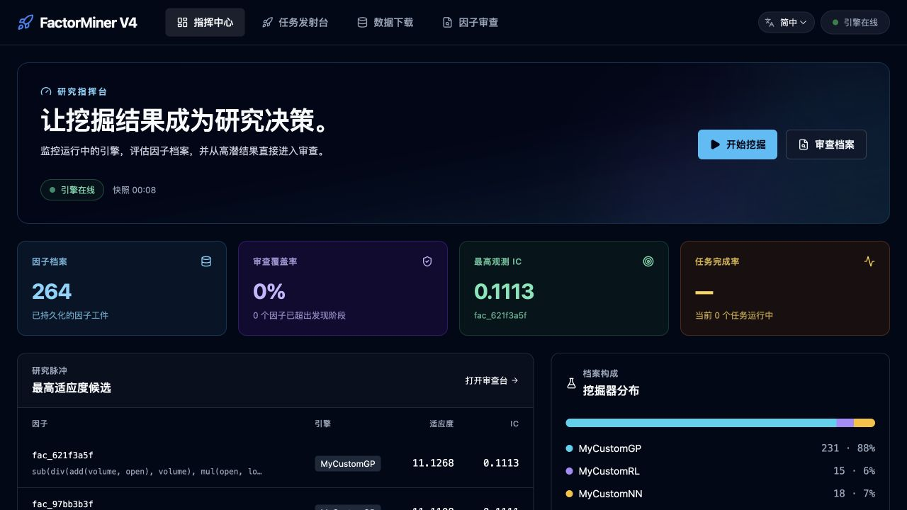
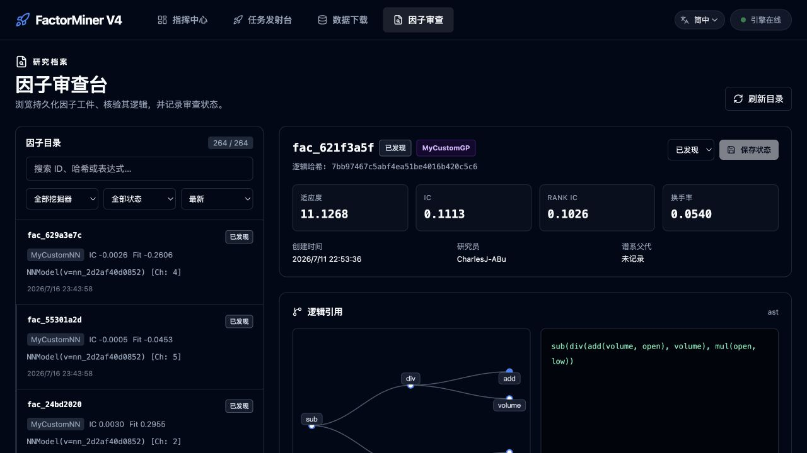

# FactorMiner - 量化因子挖掘平台 (V4)

[](https://www.python.org/)
[](LICENSE)
[]()
[](https://github.com/CharlesJ-ABu/FactorMiner)

> 🚀 **项目状态**: **V4 架构全面重构完成**（涵盖 React + FastAPI 前后端分离、以及四大挖掘范式）！
> 👨‍💻 **维护者**: [@CharlesJ-ABu](https://github.com/CharlesJ-ABu)
> 📅 **最后更新**: 2026年7月17日

FactorMiner 是一个面向量化研究的因子挖掘工作台。V4 以配置驱动的 Python 引擎为核心，提供 FastAPI + React WebUI、CLI、可持久化的因子档案，以及可由用户工作区扩展的 GP、RL、LLM 与 NN 挖掘范式。

它覆盖从历史行情读取、候选生成与评估，到任务日志、结果审查和生命周期标记的研究闭环。项目更强调可复现和可追溯：因子逻辑、指标、来源、NN 权重与通道信息都以实际落盘结果为准，而不是由前端模拟。

---

## ✨ V4 核心特性

- 🧬 **四种可扩展挖掘范式**：GP、RL、LLM、NN 统一输出 `FactorExpression`，可使用 `user_workspace` 中的自定义 Miner、算子和 Fitness Hook 扩展。
- ⚖️ **统一评估与可追溯结果**：评估器计算 IC、RankIC、Turnover 和 fitness；每个因子将逻辑、指标和来源保存为元数据，NN 同时保存权重与通道信息。
- 🖥️ **研究工作台与 CLI**：Dashboard 汇总真实任务/档案数据，Launchpad 发起并跟踪任务，Inspector 审查因子逻辑与生命周期；同一执行引擎也可从 CLI 调用。
- 🧭 **可独立使用的研究 Skills**：把交易直觉转化为框架无关的实验方案；接入 FactorMiner 后可继续生成配置、用户扩展并审查真实结果。
- 📡 **行情与命名规范**：支持本地 Feather 行情读取、缺口补全与下载。文件统一为 `{safe_symbol}-{timeframe}-{trade_type}.feather`；永续标的使用 CCXT 格式，例如 `BTC/USDT:USDT`。
- 🛡️ **已知执行边界**：当前去重是源代码 MD5 硬去重，相关性软去重尚未实现；评估使用固定 8 线程，尚未接入 Ray/Celery 分布式后端。

---

## 🏗️ V4 架构目录结构

```text
FactorMiner/
├── api/                          # FastAPI：REST、WebSocket、任务管理与 Dashboard/Inspector API
│   ├── main.py
│   └── ws_manager.py
├── core/                         # 与 UI 无关的研究执行引擎
│   ├── cli.py                    # factorminer CLI 入口
│   ├── commands/                 # mine / download / inspect 命令
│   ├── inspector/                # 因子审查引擎：因子解析、全维指标库(IC/IR/Decay/Quantiles)、Rich报告
│   ├── data_feed/                # Feather 读取、下载、补洞与命名规范
│   ├── evaluation/               # 并行评估器、指标和受限代码执行
│   ├── miner/                    # 表达式、注册表、Director、四种范式基类
│   │   └── paradigms/
│   ├── storage/                  # FactorMetadata 与本地因子档案读写
│   └── utils/dynamic_loader.py   # user_workspace 扩展动态加载
├── web/                          # React + Vite 研究工作台
│   └── src/
│       ├── pages/                # Dashboard、Launchpad、Inspector、Data Center
│       ├── layouts/              # 全局导航和语言选择器
│       ├── hooks/                # WebSocket 等前端状态逻辑
│       └── i18n.tsx              # 中文 / English / Deutsch 词典与上下文
├── user_workspace/               # 用户实验区（核心不需要为策略修改）
│   ├── configs/                  # 可复用挖掘任务配置
│   ├── custom_miners/            # GP / RL / LLM / NN 自定义 Miner
│   ├── experiment_tools/         # 可选实验留痕、汇总与测试窗口复评工具
│   ├── experiments/              # 本地原始实验记录（默认被 Git 忽略）
│   ├── custom_operators/         # 注册的时序或截面算子
│   └── custom_fitness/           # 注册的 Fitness Hook
├── skills/                       # 可独立使用、可由 FactorMiner 增强的 Agent Skills
├── factor_db/                    # 已保存因子的 metadata、values（可选）和 weights
├── data/                         # 本地历史行情：{safe_symbol}-{timeframe}-{trade_type}.feather
├── docs/
│   ├── architecture/             # V4 架构设计
│   └── assets/                   # README 使用的 WebUI 截图
├── requirements.txt
└── README.md
```

---

## 🚀 快速开始

### 1. 环境准备
```bash
# 克隆项目
git clone https://github.com/CharlesJ-ABu/FactorMiner.git
cd FactorMiner

# 建议使用 uv 或 conda 创建纯净的 Python 3.10+ 环境
python -m venv venv
source venv/bin/activate  # Mac/Linux

# 安装后端依赖
pip install -r requirements.txt

# 安装 CLI 命令入口
pip install -e .
```

### 2. 启动服务 (前后端分离)

**启动后端引擎 (FastAPI)**
```bash
# 后端运行于 8000 端口
uvicorn api.main:app --reload --host 0.0.0.0 --port 8000
```

**启动极客工作台 (React Web)**
```bash
# 新开一个终端窗口
cd web
npm install  # 仅首次需要
npm run dev
```
启动成功后，浏览器访问 `http://localhost:5173` 即可进入 FactorMiner 极客工作台。

**Factor Inspector（Phase II）**

`/inspector` 会直接读取 `factor_db/metadata/` 中已持久化的因子，而不是依赖会在服务重启后消失的任务内存。入库时，Director 会保存与评估切片对齐的 `timestamp / asset（如有）/ factor / forward_return` 快照，并记录交易对、周期、输入流、数据范围和未来收益定义。

详情页据此展示真实滚动 IC、分位平均未来收益、换手率和数据血缘；顺序单标的使用时序滚动 IC，全市场模式使用逐期截面 IC。图表不会回算、补造或以模拟结果占位。目录支持勾选 2–5 个已有快照的因子比较滚动 IC，并可批量更新生命周期状态。旧档案没有快照时会明确提示重新挖掘，而不会生成虚构 Tearsheet。

**指标与重启约定**

因子档案的唯一指标契约是 `metrics.IC`、`metrics.RankIC`、`metrics.Turnover` 和 `metrics.fitness_score`；CLI、Launchpad、Dashboard 与 Inspector 都使用这些原始字段，不使用小写别名。`0` 可以是某个候选的真实评分，但一批新因子若全部为零，应先确认后端已重启到最新 Python 代码，并检查 `factor_db/metadata/<factor_id>.json` 中的上述字段。FastAPI 重启会清空内存中的 Tracker 任务历史，却不会删除 `factor_db` 中的因子档案和 Phase II 快照。

**Research Dashboard**

首页 `/` 是研究指挥台，读取 `/api/dashboard` 聚合的任务状态与 `factor_db` 档案：可查看引擎心跳、因子库存与审查覆盖率、最高 fitness 候选、不同 Miner 的归档占比和近期执行记录。每条高质量因子可直达 Inspector，每个任务入口可直达 Launchpad；页面不会为了视觉效果生成虚构的研究曲线。

**界面语言（中文 / English / Deutsch）**

顶部导航右侧可切换简体中文、英文与德文。语言初始值跟随浏览器，并保存在本机 `localStorage`；当前已覆盖全局导航、Research Dashboard 与 Factor Inspector。因子 ID、交易对、表达式、源码、模型版本和 IC / RankIC 等研究工件保持原样，保证可复制性与可追溯性。

## 🖥️ Web UI 工作台

WebUI 将“配置一次、执行可观测、产物可审查”串成研究闭环：

- **Research Dashboard**（`/`）：引擎心跳、任务成功率、因子库存、Top 因子和范式分布。
- **Mining Launchpad**（`/launchpad`）：选择范式与配置，发起任务，并从 Tracker 打开实时日志和结果。
- **Factor Inspector**（`/inspector`）：浏览已持久化因子，审查逻辑、指标、来源和生命周期状态。
- **Data Center**（`/data`）：查看数据覆盖范围并下载数据。



*Research Dashboard：来自本地 API 的任务、因子与研究质量概览。*



*Factor Inspector：因子目录、可复现逻辑与指标审查。*

### 3. 无头模式 (CLI 命令行挖掘、归因审查与下载)

如果你希望在服务器后端挂机，或者不启动 Web 界面直接运行，FactorMiner 也提供了原生纯命令行的工业级入口：

**1. 命令行批量下载历史行情**
我们内置了 `factorminer download` 命令，可直接走高速通道批量拉取数据：
```bash
# 下载现货行情
factorminer download --exchange binance --symbols BTC/USDT,ETH/USDT --timeframes 1d,1h --type spot --start 2023-01-01 --end 2024-01-01

# 下载 U 本位永续合约行情
factorminer download --exchange binance --symbols BTC/USDT:USDT --timeframes 1m --type futures --start 2024-05-01 --end 2024-05-10
```

**2. 命令行执行因子挖掘**
使用 `factorminer mine` 工业级总控入口，通过 Config 驱动任务运行：
```bash
# 运行原生的 GP (遗传规划) 挖掘 (代数和参数均由 config 文件控制)
factorminer mine --miner GP --config user_workspace/configs/demo_config.json

# 运行你在 user_workspace 中自己写的自定义挖掘器 (例如 MyCustomGP)
factorminer mine --miner MyCustomGP --config user_workspace/configs/config.json --user-dir user_workspace

# 运行自定义 LLM 实验；API 密钥从配置指定的环境变量读取
factorminer mine --miner MyCustomLLM --config user_workspace/configs/configLLM_experiment.json --user-dir user_workspace

# 运行自定义神经网络挖掘器；--iterations 可临时覆盖配置中的训练轮数
factorminer mine --miner NN --config user_workspace/configs/configNN.json --user-dir user_workspace --iterations 5
```

**预测标签**

所有 Miner 与 Inspector 共用顶层 `target` 配置。未配置时保持历史兼容，标签为
`close[t+1] / close[t] - 1`。例如，从下一根开盘进入并持有到第 3 根
bar 收盘：

```json
{
  "target": {
    "type": "forward_return",
    "entry_price": "next_open",
    "exit_price": "close",
    "horizon_bars": 3,
    "return_type": "simple"
  }
}
```

当前支持 `current_close` / `next_open` 入场、`close` 出场，以及
`simple` / `log` 收益。标签会在每个 `mine_period` / `test_period`
内独立构造，尾部没有足够未来数据的样本为 `NaN` 并从评价中排除，不会跨越不连续区间。
因子入库时会把规范化后的 `target` 和精确公式写入数据血缘；Inspector 按 factor ID
审查时默认继承该标签。只有在 Inspector 配置中显式提供 `target` 才会覆盖，并在口径不一致时记录警告。
`DL` 是历史范式名称，现已弃用。旧命令或配置仍会暂时映射到 `NN` 并输出警告；
所有新配置、文档和界面统一使用 `NN`。

挖掘完成后，终端会直接打印全局大表 (Final Mining Summary)，记录所有存活的因子及其 IC 表现。

**3. 命令行执行因子归因与审查 (Factor Inspector)**
使用 `factorminer inspect` 命令，对任何因子（可通过 Factor ID、AST 字典字符串或 Python 源码）在指定的交易对、样本外时间段以及不同统计方法下进行全维度的深度审查：
```bash
# 审查存储在 factor_db 中的已有因子
factorminer inspect --factor "fac_dc9b98d8" --pairs "BTC/USDT:USDT"

# 直接粘贴 AST 表达式字符串进行跨币种、跨时期审查 (样本外 OOS 验证)
factorminer inspect \
  --ast "{'op': 'ts_mean', 'left': {'op': 'div', 'left': 'close', 'right': 'open'}}" \
  --pairs "BTC/USDT:USDT,ETH/USDT:USDT" \
  --start 2025-08-01 --end 2025-12-31 --timeframe 5m
```
审查结果包含 **有效数据覆盖率 (Coverage)**、**RankIC (Mean/Std/IR/t-stat)**、**Pearson IC**、**Lag 1~10 因子衰减**、**5-Quantile 分组收益与多空价差** 以及 **换手率 (Turnover)**。

`MyCustomNN` 的一条训练结果不是普通公式：训练阶段先用 `channel=-1` 的临时模型组保持计算图，训练后再将最佳输出通道物化为因子。每个结果显示为 `NNModel(v=<weights-hash>) [Ch: <n>]`，带有独立的 IC/fitness；模型权重保存至 `factor_db/weights/`，通道元数据保存至 `factor_db/metadata/`。`sequential_single` 会逐一处理配置中的交易对；若某个交易对的本地训练切片为空，CLI 会记录警告并跳过该标的，不会伪造因子结果。

若没有安装命令行入口，所有 CLI 示例都可以替换为等价模块命令：

~~~bash
python -m core.cli mine --miner MyCustomGP --config user_workspace/configs/configGP.json --user-dir user_workspace
python -m core.cli inspect --factor "fac_dc9b98d8" --pairs "BTC/USDT:USDT"
~~~

---

## 🧪 自定义 Miner、算子与 Fitness Hook

用户扩展统一放在 user_workspace。WebUI 在读取 Miner 列表和启动任务时、CLI 在执行命令时都会动态导入 custom_miners、custom_operators 和 custom_fitness 中的 Python 模块；装饰器会将实现注册到运行时注册表。

~~~text
user_workspace/
├── custom_miners/       # 四大范式或任意自定义 Miner
├── custom_operators/    # 可复用时序 / 截面算子
├── custom_fitness/      # 因子评分 Hook
├── experiment_tools/    # 可选实验记录、汇总与复评
├── experiments/         # 本地原始运行证据（Git 忽略）
└── configs/             # 可复用的任务配置
~~~

所有范式遵守同一条结果契约：

1. initialize_search_space 初始化模型、种群或记忆。
2. generate_candidates 返回可执行的 FactorExpression 子类列表。
3. evaluate_candidates 委托 self.evaluator.evaluate(candidates)，取得 EvaluationFeedback。
4. update_model 更新策略、提示词或权重后，还必须将最终通过筛选的候选放进 self.state.population（或 replay_buffer）。

第 4 条尤其重要：仅更新模型并不等于发现因子。BaseFactorMiner 最终只从 population 或 replay_buffer 读取产物；否则任务会正常完成，但 Tracker 会显示没有可保存的有效因子。

### 1. 四大范式的自定义方式

| 范式 | 可复制的起点 | 候选表达式 | 需要保留的研究产物 |
| --- | --- | --- | --- |
| GP | user_workspace/custom_miners/my_custom_gp.py | MyGPExpression / FactorExpressionAST | 可执行 AST、变异/交叉后的精英种群 |
| RL | user_workspace/custom_miners/my_custom_rl.py | MyRLExpression | 动作轨迹、已更新策略、回放或精英候选 |
| LLM | user_workspace/custom_miners/my_custom_llm.py | FactorExpressionCode | 生成代码、反思历史、已评分代码候选 |
| NN | user_workspace/custom_miners/my_custom_nn.py | FactorExpressionTensor | 权重、通道元数据、每个通道的因子结果 |

建议直接复制同范式的内置示例并修改，而不是从零实现调度循环。最小注册形式如下：

~~~python
from core.miner.paradigms.base import BaseFactorMiner
from core.miner.registry import MinerRegistry


@MinerRegistry.register("MyMomentumGP")
class MyMomentumGPMiner(BaseFactorMiner):
    def initialize_search_space(self):
        self.state.population = []

    def generate_candidates(self):
        # 返回自己的 FactorExpression 子类实例。
        return [self.make_expression()]

    def evaluate_candidates(self, candidates):
        return self.evaluator.evaluate(candidates)

    def update_model(self, candidates, feedback):
        ranked = sorted(
            zip(feedback.metrics, candidates),
            key=lambda item: item[0].get("fitness_score", float("-inf")),
            reverse=True,
        )
        self.state.population = [expr for _, expr in ranked[:20]]
~~~

#### GP：让 AST 真正能计算

GP 的候选是树形表达式。表达式的 compute() 必须把 close、open、volume 等数据流计算成与输入索引对齐的 pandas.Series。内置 MyGPExpression 展示了递归计算 AST 的方式；新增节点时，也要同步实现节点求值、复杂度统计和可读的 source。

~~~python
# 示例 AST：(close / open) - volume
{
    "op": "sub",
    "left": {"op": "div", "left": "close", "right": "open"},
    "right": "volume",
}
~~~

GP 的 update_model 通常负责选择、交叉和变异。选择后的精英表达式必须写入 state.population，而不是只打印每代日志。

#### RL：策略和因子是两类产物

RL 可以将选择算子、选择输入流、停止生成等步骤建模为 action，并在 MyRLExpression 上记录 trajectory。策略网络权重、reward 和轨迹属于训练产物；可以独立计算并带指标的表达式才是研究产物。每轮策略更新后，应从采样表达式中按 fitness 选择 Top-K，保留到 state.population 或 replay_buffer。

#### LLM：代码候选必须设置 factor

LLM 范式使用 FactorExpressionCode。顺序模式下，代码以 pandas DataFrame 变量
`df` 为输入，最终必须创建与输入索引一致、数值型且不含无穷值的
`pandas.Series factor`：

~~~python
returns = df["close"].pct_change()
factor = returns.rolling(20, min_periods=10).mean()
~~~

`cross_asset` 模式下，`df` 是“特征名 → pandas.DataFrame”的映射，每张表均为
“时间 × 资产”；`factor` 必须是轴完全一致的 DataFrame。所有 LLM 代码都必须通过
AST 白名单和带超时/CPU/内存限制的独立进程沙盒，不允许无沙盒回退。

正式因子档案只持久化 Prompt 的 SHA-256 摘要；成功与失败结果分别进入有界
Reflection 记忆，候选级 provenance 落盘前会递归移除密钥。`MyCustomLLM` 将反思
历史与高分代码候选分开保存：前者用于下一轮提示，后者按 Top-K 写入
`state.population` 供 Director 入库。

需要复盘完整生成过程时，可在配置中设置 `experiment.record_dir`，启用独立的
`LLMExperimentRecorder`。Recorder 位于
`user_workspace/experiment_tools/llm_recorder.py`，负责保存完整 Prompt、原始回答、
候选代码、执行结果、Reflection、输出哈希与确定性回放；这些原始证据写入
`user_workspace/experiments/`，该目录默认被 Git 忽略。Miner 本身仍只负责生成、
评估和更新逻辑，用户无需修改 Recorder 即可替换 Prompt 或候选策略。

LLM API 密钥应通过 `llm_api_config.keys_env` 指定的环境变量注入，不能直接写进
JSON 或源码。完整配置、无头运行、留痕和报告生成示例见
[自定义 LLM 与实验留痕指南](docs/guides/custom_llm_experiments.md)。

评估线程数可通过 `evaluation.max_workers` 配置，必须是正整数。LLM 候选每个都会启动
一个短生命周期沙盒进程，因此应结合机器内存设置并发数，例如：

~~~json
{
  "evaluation": {"max_workers": 2},
  "llm_sandbox": {
    "timeout_seconds": 5,
    "cpu_seconds": 3,
    "memory_mb": 1024
  }
}
~~~

#### NN：把训练权重物化为通道因子

NN 的训练权重不是一个可以直接评分的因子。参考 `MyCustomNNMiner` 会在
`mine_period` 拟合标准化器和 NumPy MLP，把隐藏层 channel 物化为独立的
`FactorExpressionTensor`，再使用 `test_period` 的样本外 fitness 排名。跨轮候选会做
数值相关性过滤并保留全程 Top-K，而不是只返回最后一轮。

模型以可恢复的 `factor_db/models/<model_version>.npz` 保存，其中包含权重、偏置、
特征顺序、标准化参数、数据模式和 schema 版本；旧的 `.pt` 裸权重档案仍可由
Inspector 识别。新元数据统一使用 `nn_channel / model_version / channel`；
历史 `dl_channel` 档案继续兼容读取。

用户可以直接修改 `user_workspace/custom_miners/my_custom_nn.py`，也可以复制后注册新
名称。共享引擎只要求最终表达式返回索引对齐的 `Series`（单品种）或 `DataFrame`
（跨资产），模型提供 `predict_channel()`、`clone()` 和 `export_artifact()`。更换模型
结构或存储格式时应升级 `model_format`/`schema_version`，并通过
`register_nn_model_loader()` 注册对应加载器，以免破坏历史模型重载。若只覆盖参考
Miner 的 `build_model()` 而保留其训练循环，新模型还需提供 `adapter.prepare()` 和
`train()`；完整替换训练循环则不受这一内部约束。

仓库同时提供进阶学习模板 `MyTemporalNN`：

- 仅使用当期及历史数据构造 1/3/5/15/30/60 分钟收益、滚动波动率、量价
  z-score、K 线振幅与时间周期特征；
- 以可配置的未来 5 分钟收益为标签；
- 第 0 通道是直接预测组合，其余通道是带去相关约束的隐藏表征；
- 使用 `MSE + Pearson IC Loss` 联合目标，并以有符号 RankIC 筛选正向信号；
- 模型格式 `numpy_temporal_ic_mlp_v1` 可完整重载。

可复制的约 10 分钟单品种配置位于
`user_workspace/configs/configNN_temporal_10min_template.json`。它是教学模板，不会覆盖
基础 `MyCustomNN`，也不改变 GP、RL 或 LLM 的配置。

### 2. 注册并接入自定义算子

在 user_workspace/custom_operators 中创建模块，通过 OperatorRegistry 注册函数。算子应接受、返回索引对齐的 pandas.Series：

~~~python
# user_workspace/custom_operators/robust_ops.py
import pandas as pd
from core.miner.registry import OperatorRegistry


@OperatorRegistry.register(arity=1)
def rolling_zscore(series: pd.Series) -> pd.Series:
    mean = series.rolling(20, min_periods=10).mean()
    std = series.rolling(20, min_periods=10).std().replace(0, pd.NA)
    return (series - mean) / std
~~~

CLI 与 WebUI 启动任务时会加载该模块。GP/RL 的候选生成器会把配置中允许的算子解析为统一元数据：arity=1 的算子生成只有 left 的一元 AST 节点，arity=2 的算子生成 left/right 双操作数节点；FactorExpressionAST 使用同一个运行时分发器执行内置与已注册算子。因此算子注册、配置、生成和求值已经是完整链路，不需要再修改 MyGPExpression/MyRLExpression。

~~~python
# 一元节点
{"op": "rolling_zscore", "left": "close"}

# 二元节点
{"op": "add", "left": "close", "right": "volume"}
~~~

在配置中声明可被搜索的算子：

~~~json
{
  "search_space": {
    "allowed_operators": ["add", "custom_ts_decay", "rolling_zscore"]
  }
}
~~~

默认的 MyCustomGP 搜索空间现在包含四则运算、内置的 ts_mean / ts_std，以及用户时序算子 custom_ts_decay、ts_zscore_20、ts_delta_5、ts_rank_20、ts_volatility_20。它们分别覆盖加权衰减、滚动标准化、短期变化、滚动分位位置和滚动波动率；可在 config.json 的 search_space.allowed_operators 中按研究目标增删。

当前工作区的 `config.json` 已用真实 BTC、SUI 永续 Feather 数据完成 MyCustomGP 回归：新入库候选会同时写入非空指标和 `factor_db/values/<factor_id>.parquet` 快照。该检查验证的是“注册 → AST 生成 → 求值 → fitness → metadata/快照落盘”的完整链路，而不是只验证算子可被导入。

请处理滚动窗口产生的 NaN/无穷值，并确保算子返回 pandas.Series 或 pandas.DataFrame。启动校验会拒绝 arity 非 1/2、函数签名不足、未注册的算子，以及未知的 Miner/Fitness Hook；运行时算子异常也会携带算子名，而不会静默降级为零因子。

### 3. 注册自定义 Fitness Hook

Fitness Hook 接收因子值、未来收益和评估器已计算的基础指标。可以返回单个分数，也可以返回包含 fitness_score 的字典；字典中的额外指标会随因子一起保存，便于 Inspector 审查。

~~~python
# user_workspace/custom_fitness/turnover_aware.py
from core.miner.registry import EvaluatorRegistry


@EvaluatorRegistry.register_fitness_hook("turnover_aware")
def turnover_aware(factor_values, returns, base_metrics: dict) -> dict:
    ic = float(base_metrics.get("IC", 0.0))
    turnover = float(base_metrics.get("Turnover", 0.0))
    penalty = 0.02 * turnover
    return {
        "fitness_score": abs(ic) * 100 - penalty,
        "turnover_penalty": penalty,
    }
~~~

在任务配置中精确引用注册名，并使用当前的永续 CCXT 标的格式：

~~~json
{
  "max_iterations": 5,
  "data_feeds": {
    "pairs": ["BTC/USDT:USDT"],
    "timeframe": "1h",
    "required_streams": ["close", "volume"]
  },
  "fitness": {
    "hook": "turnover_aware"
  }
}
~~~

若 Hook 名称未加载或拼写不一致，启动校验会在读取数据之前中止任务，并列出已加载 Hook；不会再静默回退。先用少量迭代验证导入、日志、候选数和最终持久化结果：

~~~bash
factorminer mine --miner MyMomentumGP --config user_workspace/configs/configGP.json --user-dir user_workspace --iterations 1
~~~

### 4. 启动校验与 CLI smoke tests

CLI 与 Launchpad 共享启动校验：动态加载失败、未知 Miner、缺失的必填数据流、无效的算子名称/arity，以及未知 Fitness Hook 都会在启动前以聚合错误报告返回。自定义 Operator 必须接收其声明 arity 所需的位置参数；Fitness Hook 必须接收 factor_values、returns、base_metrics 三个参数。

仓库的 tests/test_cli_smoke.py 为 MyCustomGP、MyCustomRL、MyCustomLLM、NN 分别创建临时 Feather 行情，通过公开 CLI 跑一轮，并验证至少一个因子元数据被写入临时 factor_db。可在提交前运行：

~~~bash
python -B -m unittest discover -s tests -v
~~~

### 5. Phase II 快照与审查口径

每个成功入库的因子会在 `factor_db/values/<factor_id>.parquet` 保存其计算值和同一评估切片的未来收益；元数据中的 `data_lineage` 保存数据来源、交易对、市场类型、周期、样本范围、输入流、规范化 `target` 和精确收益公式。Inspector 的 API 仅从该 parquet 快照生成滚动 IC、分位收益和换手率。

这意味着删除旧档案后，只有新的挖掘任务会产生可审查的 Tearsheet。若因子没有快照，先重新运行挖掘，而不要把旧的指标或前端演示图当作研究证据。

---

## 🧭 FactorMiner Skills

仓库内置的 Agent Skills 位于 [`skills/`](skills/)。

首款 **FactorMiner 因子研究设计师** 采用双模式：

- 没有安装 FactorMiner 时，把交易直觉、公式或代码整理成可交给任意量化框架实施的研究任务卡；
- 检测到当前目录是 FactorMiner 时，进一步检查现有算子，选择配置、Operator、Fitness Hook、Custom Miner 或 Inspector 路径，并基于真实运行产物形成实验报告。

它不是 FactorMiner 的使用说明书，而是一套可以独立使用的因子研究方法；FactorMiner 是其最完整的执行后端。

调用示例：

```text
使用 $factorminer-research-architect：
我认为放量突破后，短期价格会延续。请帮我设计一个严谨的实验。
```

安装、贡献和完整能力说明见 [`skills/README.md`](skills/README.md)。

---

## 📚 官方文档体系

欲了解 V4 架构的深度技术细节与组件交互原理，请前往 `docs/` 目录查阅官方文档：

1. 🏛️ **[FactorMiner V4 架构设计红皮书](docs/architecture/v4_architecture_design.md)**：包含四大流派的设计哲学、持久化追踪机制与沙盒拦截原理。
2. 🗺️ **[产品需求与功能规格 (FactorMiner_PRD)](docs/FactorMiner_PRD.md)**：项目整体功能列表。
3. 🖥️ **[前端体验规范 (WEB_UI_PRD)](web/WEB_UI_PRD.md)**：包含沉浸式大盘、Data Downloader 日志终端等 UI 设计理念。
4. ⚙️ **[网络与环境配置指南](docs/guides/vpn_setup.md)**：代理环境调优指南。

> *(注意：V3 时代的函数式 API、过期的 Streamlit 界面和 `factorlib` 结构设计均已放入 `docs/legacy_v3/` 作归档处理。)*

---

## Star History

<a href="https://www.star-history.com/?type=date&repos=CharlesJ-ABu%2FFactorMiner">
 <picture>
   <source media="(prefers-color-scheme: dark)" srcset="https://api.star-history.com/chart?repos=CharlesJ-ABu/FactorMiner&type=date&theme=dark&legend=top-left&sealed_token=hzreCWwyuEBXzGUPFeK2U5i-NyE72I4SADmwiCn6xntum1-jt6CU5xPipLkgoTUjydo-f4cyh-Z-fSufzROBd4hgraf6QDyy34-a1PXCAIDwj95m1-t-vyaPEbgR_IfMFlppsgv_Vwyf-hY2BDKIoVLuW0NJnkWWwc_dG1SIpcX-kNb6cy7LmlayhqIf" />
   <source media="(prefers-color-scheme: light)" srcset="https://api.star-history.com/chart?repos=CharlesJ-ABu/FactorMiner&type=date&legend=top-left&sealed_token=hzreCWwyuEBXzGUPFeK2U5i-NyE72I4SADmwiCn6xntum1-jt6CU5xPipLkgoTUjydo-f4cyh-Z-fSufzROBd4hgraf6QDyy34-a1PXCAIDwj95m1-t-vyaPEbgR_IfMFlppsgv_Vwyf-hY2BDKIoVLuW0NJnkWWwc_dG1SIpcX-kNb6cy7LmlayhqIf" />
   
 </picture>
</a>

## 🤝 贡献与反馈

欢迎各位同好提交 PR！在使用中遇到任何 Bug 或有新的因子评估建议，请随时在 [Issues](https://github.com/CharlesJ-ABu/FactorMiner/issues) 提交。
量化之路漫漫，愿 **FactorMiner** 助你挖掘出最强的 Alpha。

## 📄 许可证

本项目基于 MIT 许可证。详见 [LICENSE](LICENSE) 文件。
